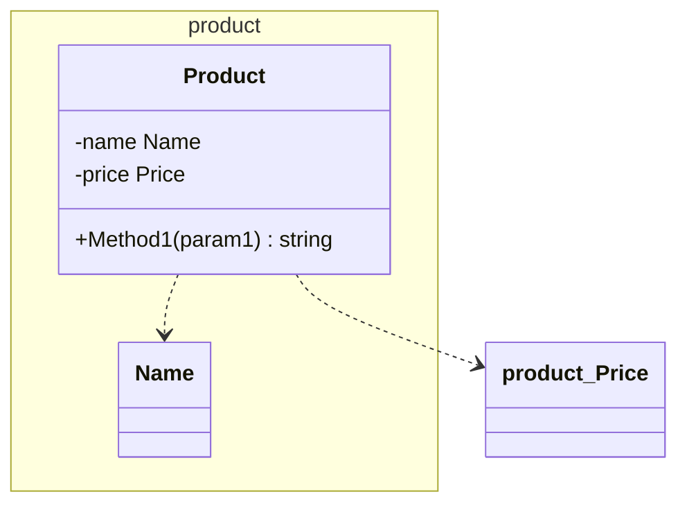

# Phase 3: 中間表現(IR) + Mermaid クラス図 — MVP

**目的**: E2E で動く最初の価値。`diagoram <dir>` が Mermaid クラス図を stdout に出す。
**完了時の姿**: fixture に対する golden テストが通り、実プロジェクト（diagoram 自身）に実行して図が GitHub 上でレンダリングできる。完了時に **v0.1.0** タグ。

## 前提
- Phase 2 完了（`gocode.Parse` が動く）

## 中間表現（`internal/diagram`）

php-class-diagram の Relation/Package/Entry/Arrow 構成を Go 流に翻訳する。

```go
// gocode の言語モデルから図モデルを構築する
func Build(pkgs []*gocode.Package) *Diagram

type Diagram struct {
    Root  *PackageNode // ディレクトリ階層の再帰ツリー
    Edges []Edge       // 全エッジ（ソート済み・重複除去済み）
}

type PackageNode struct {
    Name     string         // 階層の 1 セグメント
    Path     string         // ルートからの相対パス
    Children []*PackageNode
    Entries  []*Entry       // このパッケージ直下の型
}

type Entry struct {
    ID      string // 図の中で一意な安全化済み識別子（例: product_attribute_Color）
    Name    string // 表示名
    Kind    Kind   // KindStruct | KindInterface
    Doc     string
    Fields  []gocode.Field
    Methods []gocode.Method
}

type Edge struct {
    From, To     string   // Entry.ID
    Kind         EdgeKind // Dependency | Embedding（Implementation は Phase 5）
    ToCollection bool     // 依存先がスライス/マップ（多重度 "*" 表示用）
}
```

### 構築ルール
- ディレクトリパスをセグメント分割して PackageNode ツリーへ（php-class-diagram の `Package::addEntry` と同じ発想）
- **ID の安全化**: パス区切り `/` とハイフン等を `_` に置換。Mermaid/PlantUML 双方で識別子として安全な文字のみにする
- **依存エッジ**: Entry のフィールド型・メソッド引数/戻り値の TypeRef を解決し、**解析対象内に存在する型に限り** Dependency エッジを張る
  - 同一パッケージ内: `TypeRef.PkgName == ""` → 同パッケージの Entry を検索
  - パッケージ跨ぎ: `TypeRef.PkgName` を import（alias 考慮）でパスに解決 → 該当パッケージの Entry を検索
  - プリミティブ・対象外パッケージの型はエッジにしない
  - 自己参照エッジは張らない。同一ペアの重複エッジは 1 本にまとめる
- **埋め込みエッジ**: struct/interface の Embeds から Embedding エッジ
- Edges は必ず決定的な順序にソート

## Mermaid レンダラ（`internal/render/mermaid`）

```go
type Renderer interface { Render(d *diagram.Diagram, opt Options) (string, error) } // internal/render に定義
```

出力仕様（golden テストで固定する）:



- パッケージ → `namespace`（Mermaid の namespace はネスト不可のため、**パッケージパスをフラットに 1 namespace 化**する。例: `product/attribute` → `namespace product_attribute`）。表示名が失われないようクラス側はラベル記法 `id["表示名"]` を使う
- struct → `class`、interface → `class` + `<<interface>>`
- 可視性: exported `+` / unexported `-`
- フィールド: `[+-]名前 型`（型は `TypeRef.String` の表記）
- メソッド: `[+-]名前(引数型...) 戻り値型`
- エッジ: Dependency `..>`、Embedding `--|>`、コレクション依存はラベルで多重度 `.."*"` 相当を表現（Mermaid の記法制約に合わせ `A ..> B : *` で妥協してよい。golden で固定）
- インデントはスペース 4、改行 `\n`、末尾改行 1 つ

## CLI 統合

- `cli.Run`: `<dir>` → `gocode.Parse` → `diagram.Build` → `mermaid.Render` → stdout
- このフェーズで追加するフラグ: `--class-diagram`（デフォルトなので指定しなくても同じ）, `--include`, `--exclude`（複数指定可: `flag.Func` で累積）

## タスク（TDD 順）

- [x] 3-1. `diagram.Build` のテスト先行（fixture `basic` → Entry/Edge の期待値を table test）→ 実装
- [x] 3-2. パッケージ跨ぎ依存の解決（fixture `multi-package`）テスト → 実装
- [x] 3-3. 埋め込みエッジ（fixture `interfaces`）テスト → 実装
- [x] 3-4. mermaid レンダラ: fixture 4 種 × golden ファイル（`expected-class.mmd`）を先に書く → 実装
  - golden の中身は実装前にオーケストレーターがレビューし「この図が欲しい」を確定させる（ここが振る舞い調整の要）
- [x] 3-5. CLI 統合の E2E テスト（`cli.Run` を fixture に向けて実行し golden 比較）
- [x] 3-6. ドッグフーディング: `go run ./cmd/diagoram .` を diagoram 自身に実行し、出力を GitHub/mermaid.live でレンダリング確認
- [x] 3-7. コードレビュー → コミット → **v0.1.0** タグ

## 受け入れ基準
- fixture 4 種の golden テストが全緑
- `diagoram testdata/fixtures/multi-package` の出力をそのまま mermaid.live に貼ると正しく描画される（構文エラーがない）
- 出力が決定的（連続実行で diff ゼロ）

## スコープ外
- パッケージ依存図（Phase 4）、rel-target 等のフィルタ（Phase 5）、PlantUML（Phase 6）

## 実装時の決定事項（Phase 3 完了時に記録）
- 型表記の Mermaid 安全化（render/mermaid/typeformat.go）: `TypeRef.String` を go/parser で再パースし、`[]T`→`T[]`、`map[K]V`→`Map~K,V~`、ジェネリクス `Box[int]`→`Box~int~`、匿名struct/func/chan/interface は裸のキーワードに縮約。実 mermaid パッケージの `mermaid.parse()` で全 golden + ドッグフード出力の構文正当性を検証済み
- Entry.Doc は IR まで運ぶが Mermaid では描画しない（クラス本体に自由テキストの安全な置き場がないため。PlantUML レンダラで使う予定）
- フィールド/メソッドが空の struct は `{ }` なしの 1 行、interface は `<<interface>>` があるため常にボディつき
- import パス→ディレクトリ解決は最長サフィックス一致のヒューリスティック（diagram.resolveImportDir）。go.mod の module パス読み取りによる正確化は Phase 4 で行う
- `--class-diagram` フラグは受理するのみ（デフォルト動作と同一。Phase 4 で --package-diagram との排他に使う）
