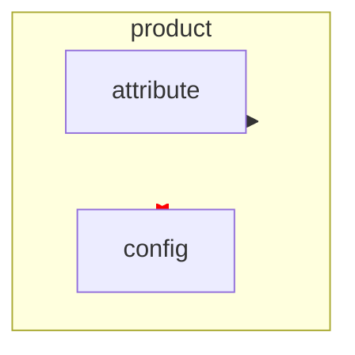

# Phase 4: パッケージ依存図 + 循環依存の警告

**目的**: php-class-diagram の看板機能「パッケージ関連図と相互依存の赤線警告」を Go 版で実現する。
**完了時の姿**: `diagoram --package-diagram <dir>` がパッケージ間依存の Mermaid flowchart を出し、相互依存が赤太線で目立つ。完了時に **v0.2.0** タグ。

## 前提
- Phase 3 完了（IR とレンダラ基盤がある）

## 設計

### パッケージ依存の集計（`internal/diagram`）
- 材料は `gocode.Package.Imports`。**解析対象内のパッケージ同士の import 関係のみ**をエッジ化する
  - import パスと解析対象ディレクトリの対応付け: ルートの `go.mod` があれば module パスを読んで正確にマッピング（`go.mod` の module 行を読むだけ。ビルドはしない）。無ければ import パス末尾とディレクトリパスのサフィックス一致で近似
- 解析対象外（標準ライブラリ・外部モジュール）は**デフォルト非表示**。`--show-external` 指定時のみ薄色ノードで表示（php-class-diagram の `#DDDDDD` 外部パッケージ表示に相当）
- **相互依存（A→B かつ B→A）を検出**し、エッジに `Mutual` フラグを立てる
  - 2 パッケージ間の直接相互参照だけでなく、SCC（強連結成分）まではやらない。まず直接相互のみ（シンプル優先。SCC は将来課題としてコメントを残す）

```go
type PackageEdge struct {
    From, To string // パッケージパス
    Mutual   bool   // 相互依存
}
func BuildPackageGraph(pkgs []*gocode.Package, modulePath string) ([]PackageEdge, ...)
```

### Mermaid 出力仕様（golden で固定）



- パッケージ階層は `subgraph` のネストで表現（flowchart はネスト可能）
- 相互依存は 1 本の `<-->` にまとめ、`linkStyle N stroke:red,stroke-width:4px` で赤太線
- エッジ順は決定的にソート（linkStyle のインデックスが安定するため必須）

### CLI
- `--package-diagram` フラグ追加（`--class-diagram` と排他。両方指定はエラーで案内）
- `--show-external` フラグ追加

## タスク（TDD 順）

- [ ] 4-1. fixture 追加: `testdata/fixtures/dependency-loops/` — 相互に import し合う 2 パッケージ + 通常依存を含む構成（go.mod 付き）
- [ ] 4-2. `go.mod` の module パス読み取り（テスト先行。go.mod 無しケースも）
- [ ] 4-3. `BuildPackageGraph` のテスト先行（依存集計・対象外除外・相互依存フラグ）→ 実装
- [ ] 4-4. mermaid パッケージ図レンダラ: golden（`expected-package.mmd`）を先に書きレビュー → 実装。linkStyle の安定性テストを含める
- [ ] 4-5. CLI 統合 E2E テスト（`--package-diagram`、排他エラー、`--show-external`）
- [ ] 4-6. ドッグフーディング: diagoram 自身のパッケージ図を目視確認
- [ ] 4-7. コードレビュー → コミット → **v0.2.0** タグ

## 受け入れ基準
- fixture `dependency-loops` で赤太線の相互依存が golden で固定されている
- 出力を mermaid.live に貼って正しく描画される
- 外部パッケージがデフォルトで出ないこと・`--show-external` で出ることがテストされている

## スコープ外
- SCC による間接循環の検出（将来課題）
- PlantUML でのパッケージ図（Phase 6）
