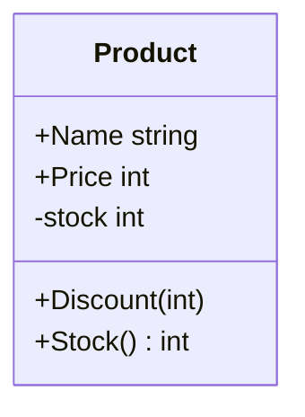
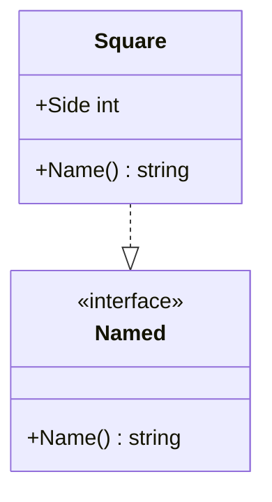
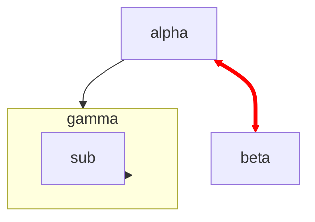
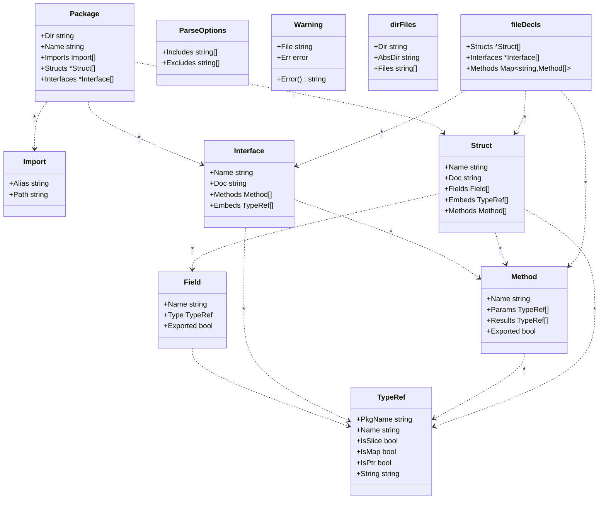
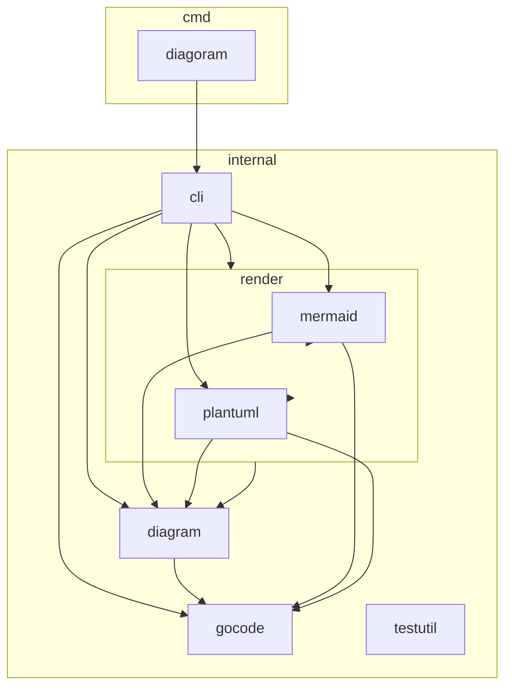

# diagoram

[](https://github.com/shimabox/diagoram/actions/workflows/test.yml)
[](https://pkg.go.dev/github.com/shimabox/diagoram)
[](LICENSE)

**A zero-dependency Go CLI that reads Go source with `go/parser`/`go/ast` and prints a Mermaid or PlantUML class diagram / package dependency diagram — no build step, no config file.**

Go のソースコードを構文解析（`go/parser` + `go/ast` のみ、ビルド不要）して、struct/interface の**クラス図**と**パッケージ依存図**を Mermaid / PlantUML テキストとして出力する CLI ツールです。設定ファイルなしで `diagoram <dir>` と打つだけで、意味のある図がすぐ手に入ります。

[smeghead/php-class-diagram](https://github.com/smeghead/php-class-diagram) の思想（ソースから図を継続生成し、設計の歪みを可視化する）を Go 向けに再構築しています。

## Why

複雑になっていく Go プロジェクトを改善するには、まず依存関係を目で見る必要があります。diagoram は:

- **外部依存ゼロ**。標準ライブラリの `go/parser`/`go/ast` のみで解析するので、対象コードをビルドできる必要すらありません。壊れかけの WIP コードにも使えます。
- **Mermaid をネイティブ出力**するので、GitHub の README や PR にそのまま貼るだけで図として表示されます。
- パッケージ同士が**直接お互いを import し合っている**（設計上の危険信号）と、赤い太線で警告します。

## Install

### go install

```sh
go install github.com/shimabox/diagoram/cmd/diagoram@latest
```

### Docker

```sh
docker run --rm -v "$PWD:/work" ghcr.io/shimabox/diagoram /work
```

イメージはビルドステージ以外は `scratch`（`golang:1.24-alpine` でビルドした静的バイナリ 1 本のみ）なので、数 MB しかありません。手元でビルドする場合は:

```sh
docker build -t diagoram .
```

### リリースバイナリ

タグ push のたびに [Releases](https://github.com/shimabox/diagoram/releases) に linux / darwin / windows × amd64 / arm64 のバイナリが添付されます。ダウンロードして展開し、PATH の通った場所に置いてください。

## Quick Start

こんな Go コードがあったとします:

```go
package shop

type Product struct {
	Name  string
	Price int
	stock int
}

func (p *Product) Discount(percent int) {
	p.Price -= p.Price * percent / 100
}

func (p *Product) Stock() int {
	return p.stock
}
```

```sh
diagoram ./shop
```

出力（実際に diagoram を実行した結果そのまま。GitHub 上ではこの ```` ```mermaid ```` ブロックが下のように図としてレンダリングされます）:



`+`/`-` はそれぞれ exported / unexported（Go の可視性ルールそのまま、識別子の大文字始まりで判定）です。

## 図の種類

### クラス図（`--class-diagram`、デフォルト）

struct / interface をクラスとして描画します。エッジの種類:

| 記法 | 意味 |
|---|---|
| `..>` | 依存（フィールドの型・メソッドの引数/戻り値の型参照） |
| `--\|>` | 埋め込み（struct/interface の embedding） |
| `..\|>` | interface 実装（メソッドシグネチャ照合によるヒューリスティック検出。解析対象内の型同士のみ） |

例（interface 実装の検出。これも実際の出力です）:



### パッケージ依存図（`--package-diagram`）

ディレクトリ構造をそのままネストした図として、パッケージ間の import 関係を描画します。**2 つのパッケージが互いを直接 import している**場合（実際の Go ビルドなら失敗する循環依存）は、赤い太い双方向矢印で強調します。これは php-class-diagram から受け継いだ、設計改善のための一番の目玉機能です。



（`alpha` と `beta` が互いを import している。上記は `testdata/fixtures/dependency-loops` に対する実際の出力です）

`--show-external` を付けると、標準ライブラリや他モジュールなど `<dir>` の外側のパッケージも薄い色のノードとして表示されます。

## オプション一覧

```sh
diagoram [options] <dir>
```

| オプション | 説明 |
|---|---|
| `--class-diagram` | クラス図を出力（デフォルト）。`--package-diagram` と併用不可 |
| `--package-diagram` | パッケージ依存図を出力。相互依存は赤い太い双方向矢印で警告。`--class-diagram` と併用不可 |
| `--format=mermaid\|plantuml` | 出力形式（デフォルト `mermaid`）。`--summary` と併用時は無視される |
| `--show-external` | `<dir>` の外側のパッケージ（標準ライブラリ・他モジュール）も薄い色のノードとして描画。`--package-diagram` にのみ影響 |
| `--hide-unexported` | 非公開（unexported）のフィールド・メソッドを隠す。クラス図・`--summary` にのみ影響 |
| `--disable-fields` | クラス図にフィールドを描かない。クラス図・`--summary` にのみ影響 |
| `--disable-methods` | クラス図にメソッドを描かない。クラス図・`--summary` にのみ影響 |
| `--disable-implements` | ヒューリスティックで検出した interface 実装関係を描かない。クラス図・`--summary` にのみ影響 |
| `--rel-target='A,B'` | 指定した型から辿れる型だけに絞り込む（カンマ区切り、複数指定可）。型名単体（`Product`）または `pkg.Type` 形式（`attribute.Color`）。クラス図・`--summary` にのみ影響 |
| `--rel-target-depth=N` | `--rel-target` 使用時に辿る依存の深さ（デフォルト `1`） |
| `--summary` | 図の代わりに解析した型の一覧をプレーンテキストで出力。`--package-diagram` と併用不可 |
| `--include='glob'` | 対象ファイルパターン（複数指定可、デフォルト `*.go`） |
| `--exclude='glob'` | 除外パターン（複数指定可、デフォルト `*_test.go`。再指定するとデフォルトを置き換える） |
| `-h`, `--help` | ヘルプを表示して終了 |
| `-v`, `--version` | バージョン情報を表示して終了 |

大規模なプロジェクトで図が密になりすぎる場合は `--rel-target` で見たい型の周辺だけに絞り込んでください。

## PlantUML を画像化する

`--format=plantuml` は PlantUML 記法のテキストを出力します。PNG/SVG への画像化には Java 実行環境（PlantUML 本体）が要るため、diagoram には同梱していません（Mermaid はテキストのまま GitHub で描画できるため、そちらの利用を基本としています）。画像化したい場合は公式 Docker イメージを使ってください:

```sh
diagoram --format=plantuml . > diagram.puml
docker run --rm -v "$PWD:/work" plantuml/plantuml -tsvg /work/diagram.puml
# => /work/class-diagram.svg (ファイル名は .puml 内の @startuml <name> から決まる)
```

## ドッグフーディング

diagoram を diagoram 自身にかけた図です。`update-dogfood.sh` で再生成できます（ソースを変更したら実行してください）。

### diagoram 自身のクラス図（`internal/gocode` — 言語モデル）

<!-- DOGFOOD:CLASS:START -->

<!-- DOGFOOD:CLASS:END -->

### diagoram 自身のパッケージ依存図

<!-- DOGFOOD:PACKAGE:START -->

<!-- DOGFOOD:PACKAGE:END -->

## License

[MIT](LICENSE)
