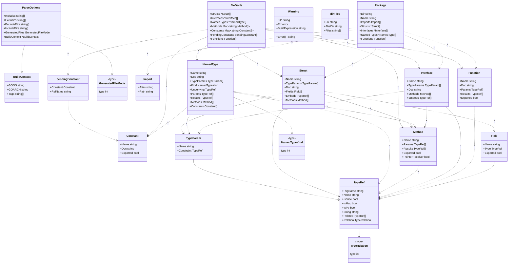
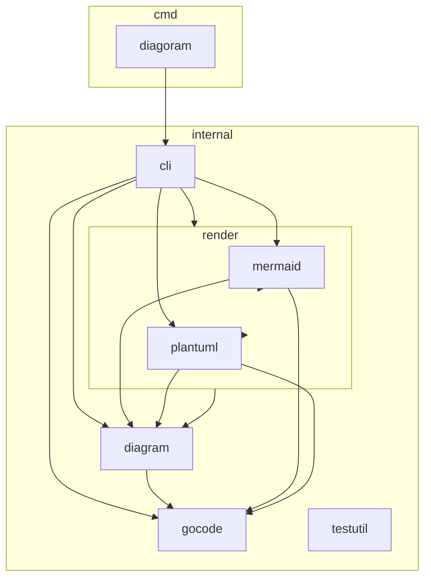

# diagoram

[](https://github.com/shimabox/diagoram/actions/workflows/test.yml)
[](https://pkg.go.dev/github.com/shimabox/diagoram)
[](LICENSE)

diagoram is a CLI that statically analyzes Go source and generates Mermaid/PlantUML diagrams, Markdown analysis reports, and an offline HTML portal. No build step, no external dependencies. Documentation is in Japanese.

Goコードの構造を、読み始める前に把握するためのCLIです。

ソースコードを静的解析し、型と依存関係を図やMarkdownレポートにします。対象プロジェクトのビルドや設定は必要ありません。

[smeghead/php-class-diagram](https://github.com/smeghead/php-class-diagram) の、ソースコードから図を継続して生成し、設計を見直すという考え方を参考にしています。

## 特徴

- go/parserでソースを直接解析するため、ビルドや依存パッケージの取得は不要です（構文エラーのあるファイルは警告して読み飛ばします）
- go.modに外部依存はなく、同梱するJSもgo:embedでバイナリに含めています
- `--report`はMarkdownの解析レポートを出力し、設計評価は渡した生成AIやレビュー担当者に委ねます
- MermaidとPlantUMLの両方に対応しています
- `--html`のHTMLポータルは外部CDNに依存せずオフラインで開けます
- パッケージ依存図では、2パッケージ間の直接的な循環依存を赤い太線で示します

## 何に役立つか

- 初めて触るコードの全体像をつかむ
- 型やパッケージの依存関係を確認する
- 公開APIや特定の型に絞って設計を見直す
- 解析結果を生成AIへ渡して、改善点や影響範囲の助言を得る

## 一番有効な使い方

初めて触るGoリポジトリの公開APIを解析し、生成AIと一緒に設計を確認する使い方です。

diagoramはまだ開発初期のツールで、フラグ名や出力形式は今後変わることがあります。

### 1. インストールする

```sh
go install github.com/shimabox/diagoram/cmd/diagoram@latest
diagoram --version
```

バージョンが表示されれば準備完了です。

#### ソースからローカルで実行する

リポジトリを取得済みなら、インストールせずに実行できます。

```sh
go run ./cmd/diagoram --version
go run ./cmd/diagoram --report --public-api --max-members=20 /path/to/go-project > analysis.md
```

バイナリを作る場合はリポジトリのルートでビルドします。

```sh
go test ./cmd/... ./internal/...
go build -o ./diagoram ./cmd/diagoram

./diagoram --version
./diagoram --report --public-api --max-members=20 /path/to/go-project > analysis.md
```

ローカルビルドのバージョンは `dev` と表示されます。生成された `diagoram` は `.gitignore` の対象です。

<details>
<summary>Goを使わずにインストールする</summary>

各OS向けのバイナリは [Releases](https://github.com/shimabox/diagoram/releases) からダウンロードできます。

Dockerでも実行できます。

```sh
docker run --rm -v "$PWD:/work" ghcr.io/shimabox/diagoram /work
```

</details>

### 2. 解析レポートを作る

調べたいリポジトリのルートで実行します。

```sh
cd /path/to/go-project
diagoram --report --public-api --exclude-generated --max-members=20 . > analysis.md
```

対象プロジェクトのビルドや依存パッケージの取得は不要です。

### 3. 出力を確認する

```sh
sed -n '1,40p' analysis.md
```

`Go source analysis report` から始まり、Scope、Analysis settings、Structural summary、Types and relationships、Diagnosticsがあれば解析できています。GitHubやVS CodeのMarkdownプレビューではMermaid図も確認できます。

<details>
<summary>レポートの先頭例を見る</summary>

```markdown
# Go source analysis report

## Scope

- Directory `.`
- Module `example.com/project`
- Build context `union`
- Diagnostics `0`

## Analysis settings
```

</details>

### 4. 生成AIへ渡す

`analysis.md` を添付して、確認したい内容を伝えます。

```text
この解析レポートを基に、責務が集中している型と変更の影響が広がりやすい依存関係を指摘してください。
指摘ごとに根拠となる型名と依存関係を示し、次に詳しく解析すべき型を提案してください。
```

### 5. 気になった型を詳しく見る

生成AIが挙げた型の周辺だけを再解析します。`Product` は確認したい型名に置き換えます。

```sh
diagoram --report --rel-target=Product --rel-target-depth=2 --max-members=30 . > product-analysis.md
```

最初のレポートで全体をつかみ、型を絞ったレポートで詳しく確認する流れを繰り返します。

<details>
<summary>図だけを出力する</summary>

structやinterface、名前付き型と、それらの依存関係をMermaid図で出力します。

```sh
diagoram . > types.md
```

パッケージ間のimport関係を出力します。

```sh
diagoram --package-diagram . > package-diagram.md
```

</details>

## 得られるもの

| 出力 | 分かること |
|---|---|
| 解析レポート | 型の構成、依存の理由、解析条件、読み飛ばしたファイル |
| 型と依存関係の図 | struct、interface、名前付き型、メンバー、型同士の関係 |
| パッケージ依存図 | ディレクトリ構造、import関係、相互依存 |
| 構造要約 | パッケージごとの型、メンバー数、主な依存関係 |

構文エラーを含むファイルは警告して読み飛ばすため、作業途中のコードも解析できます。

## HTMLポータルでまとめて見る

`--html=<dir>` を指定すると、型と依存関係の図・パッケージ依存図・解析レポート・構造要約を一括生成し、`index.html` から横断的に閲覧できます。図はMermaidでブラウザ上に描画され（PlantUMLソースも同梱）、外部CDNへの参照は一切ないため、`<dir>`をブラウザで直接開くだけで完結します。

```sh
diagoram --html=_site .
```

```sh
open _site/index.html   # macOS。他OSではブラウザで直接開いてください
```

ドッグフーディング（diagoram自身をdiagoramで解析してポータルを作る）例:

```sh
go run ./cmd/diagoram --html=_site --exclude-dir=tmp .
```

このリポジトリでは `main` への push を契機に上記コマンドを実行し、GitHub Pages（https://shimabox.github.io/diagoram/ ）へ自動公開しています。

`--html` は `--class-diagram` / `--package-diagram` / `--summary` / `--report` と併用できません（いずれもポータルに含まれるため）。詳細は[オプション一覧](docs/options.md)を参照してください。

<details>
<summary>diagoram自身の解析結果を見る</summary>

`internal/gocode` の型やメンバー、依存関係を表示しています。

<!-- DOGFOOD:CLASS:START -->

<!-- DOGFOOD:CLASS:END -->

パッケージ依存図はリポジトリ全体を対象にしています。

<!-- DOGFOOD:PACKAGE:START -->

<!-- DOGFOOD:PACKAGE:END -->

</details>

## 詳細

- [出力形式と読み方](docs/outputs.md)
- [オプション一覧](docs/options.md)

## 開発

```sh
go test ./...
```

## License

[MIT](LICENSE)
