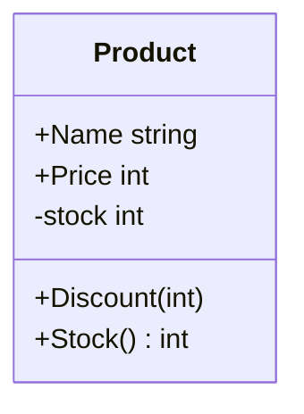

# diagoram

[](https://github.com/shimabox/diagoram/actions/workflows/test.yml)
[](https://pkg.go.dev/github.com/shimabox/diagoram)
[](LICENSE)

Go のソースコードから Mermaid または PlantUML のクラス図とパッケージ依存図を生成する CLI です。

標準ライブラリの `go/parser` と `go/ast` だけで解析するため、対象プロジェクトのビルドや設定ファイルは必要ありません。構文エラーを含むファイルは警告して読み飛ばすので、作業途中のコードにも使えます。

[smeghead/php-class-diagram](https://github.com/smeghead/php-class-diagram) の、ソースから図を継続生成して設計の歪みを見つけるという考え方を Go 向けに実装しています。

## インストール

```sh
go install github.com/shimabox/diagoram/cmd/diagoram@latest
```

Docker でも実行できます。

```sh
docker run --rm -v "$PWD:/work" ghcr.io/shimabox/diagoram /work
```

各OS向けのバイナリは [Releases](https://github.com/shimabox/diagoram/releases) からダウンロードできます。

## 使い方

```sh
diagoram [options] <dir>
```

引数に指定したディレクトリ以下の Go ファイルを解析し、標準出力に図を出力します。デフォルトは Mermaid のクラス図です。

```sh
diagoram ./shop
```



`+` は exported、`-` は unexported のメンバーを表します。

### クラス図

struct、interface、名前付きのscalar・array・slice・map・function型、type aliasと、その型同士の関係を描画します。

| 記法 | 意味 |
|---|---|
| `..>` | フィールド、メソッド引数、戻り値による依存 |
| `--\|>` | struct または interface の埋め込み |
| `..\|>` | メソッドシグネチャから推定した interface 実装 |

実装関係の検出は構文情報による推定です。解析対象内の型だけを照合します。

### パッケージ依存図

`--package-diagram` を付けると、ディレクトリ構造と import 関係を描画します。2つのパッケージが互いを直接 import している場合は、赤い太線で表示します。

```sh
diagoram --package-diagram .
```

`--show-external` を付けると、標準ライブラリや他モジュールへの依存も表示します。

### PlantUML

`--format=plantuml` で PlantUML を出力できます。画像への変換には PlantUML を別途用意してください。

```sh
diagoram --format=plantuml . > diagram.puml
docker run --rm -v "$PWD:/work" plantuml/plantuml -tsvg /work/diagram.puml
```

## オプション

| オプション | 説明 |
|---|---|
| `--class-diagram` | クラス図を出力。デフォルト |
| `--package-diagram` | パッケージ依存図を出力 |
| `--format=mermaid\|plantuml` | 出力形式を指定。デフォルトは `mermaid` |
| `--show-external` | パッケージ依存図に外部パッケージを含める |
| `--hide-unexported` | unexported の型、フィールド、メソッドを隠す |
| `--show-constants` | 名前付き型に属する定数をクラス図に表示 |
| `--show-functions` | package-level functionをクラス図に表示 |
| `--function='glob'` | 表示するpackage-level functionを名前で絞る。複数指定可 |
| `--method='glob'` | 表示するmethodを名前で絞る。複数指定可 |
| `--max-members=N` | fields、methods、constants、functionsを種類ごとに最大N件表示 |
| `--public-api` | 非公開identifierとinternal・example・test・benchmark packageを除外 |
| `--disable-fields` | フィールドを描画しない |
| `--disable-methods` | メソッドを描画しない |
| `--disable-implements` | 推定した interface 実装関係を描画しない |
| `--rel-target='A,B'` | 指定した型から辿れる型だけに絞る。複数指定可 |
| `--rel-target-depth=N` | `--rel-target` で辿る深さ。デフォルトは `1` |
| `--summary` | 図の代わりに型の一覧を出力 |
| `--include='glob'` | 対象ファイルのパターンを指定。複数指定可 |
| `--include-dir='glob'` | 対象directoryとその配下を相対パスで指定。複数指定可 |
| `--exclude='glob'` | 除外ファイルのパターンを指定。複数指定可 |
| `--exclude-dir='glob'` | 除外ディレクトリの相対パスを指定。複数指定可 |
| `--goos=GOOS` | 対象GOOSのbuild constraintを適用 |
| `--goarch=GOARCH` | 対象GOARCHのbuild constraintを適用 |
| `--build-tag=tag` | build tagを追加。複数指定可 |
| `-h`, `--help` | ヘルプを表示 |
| `-v`, `--version` | バージョンを表示 |

`--class-diagram` と `--package-diagram` は併用できません。`--summary` と `--package-diagram` も併用できません。

大きなプロジェクトでは `--rel-target` を使うと、確認したい型の周辺だけを表示できます。型名は `Product` または `attribute.Color` の形式で指定します。

外部から利用できるAPIの概要だけを見る場合は `--public-api` を使います。functionやmethodが多い場合は名前のglobを追加できます。

```sh
diagoram --public-api --summary .
diagoram --public-api --function='New*' --method='Get*' .
```

## 開発

```sh
go test ./...
```

## License

[MIT](LICENSE)
